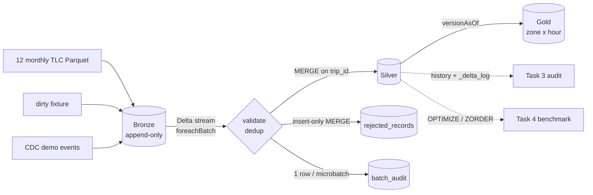

# Delta Lakehouse Architecture and Storage Optimization - Report

- Team name: Group 2
- Members: Nguyen Thi Thu Trang, Nguyen Duong Hieu, Nghiem Tra My, Le Thi Anh Thu, Hoang Thi Thanh Nhan, Nguyen Vinh Khanh, Thanh Uyen Dung

Dataset: NYC TLC Yellow Taxi trip records, January-December 2025
(12 Parquet files, 48,722,602 trips). Stack: Python 3.11, PySpark 3.4.1,
delta-spark 2.4.0, local mode on a macOS laptop (8 cores, external SSD).

---

# Part A - Theory

## A1. Data Warehouse vs Data Lake vs Lakehouse

| Aspect            | Data Warehouse                             | Data Lake                                               | Lakehouse                                                   |
| ----------------- | ------------------------------------------ | ------------------------------------------------------- | ----------------------------------------------------------- |
| Storage           | proprietary, coupled to the engine         | open files (Parquet, CSV, JSON) on cheap object storage | open files + an open transaction log (Delta, Iceberg, Hudi) |
| Data types        | structured                                 | any (structured, semi-, unstructured)                   | any                                                         |
| Schema            | schema-on-write, enforced                  | schema-on-read, not enforced                            | enforced on write, evolvable                                |
| Transactions      | full ACID                                  | none; partial writes visible, no isolation              | ACID per table through the log                              |
| Updates / deletes | SQL DML                                    | rewrite files by hand                                   | `MERGE`, `UPDATE`, `DELETE`                                 |
| History           | limited (vendor features)                  | none                                                    | time travel by version / timestamp                          |
| Workloads         | BI / SQL                                   | data science, ML, raw archive                           | BI, SQL, streaming and ML on one copy                       |
| Cost / openness   | high, lock-in                              | low, open                                               | low, open                                                   |
| Typical problem   | expensive, rigid, duplicated copies for ML | "data swamp": inconsistent, unreliable files            | needs table maintenance (compaction, vacuum)                |

A lakehouse keeps the cheap open storage of a lake and adds the reliability
and management features of a warehouse through a metadata layer.

### Delta Lake features used in this project

| Feature                               | Where                                                           |
| ------------------------------------- | --------------------------------------------------------------- |
| ACID appends and MERGE                | Bronze appends, Silver / rejected / audit MERGEs                |
| Schema enforcement and evolution      | type widening in Bronze, `surcharge_fee` added by MERGE         |
| Time travel (`versionAsOf`)           | Task 3 audit, Gold pinned to a Silver version, benchmark states |
| History and commit metrics            | row counts, version discovery, audit                            |
| Streaming source with checkpoint      | incremental Bronze -> Silver                                    |
| `OPTIMIZE` / `ZORDER BY`              | Task 4                                                          |
| Per-file statistics and data skipping | Task 4 (files read 688 -> 1)                                    |

## A2. The transaction log (`_delta_log`)

A Delta table is a directory of Parquet data files plus `_delta_log/`.
The log is the source of truth: a data file that no commit references is not
part of the table.

- **Commits**: `00000000000000000000.json`, `...001.json`, ... One file per
  version; each line is one action.
- **Actions**:

  | Action       | Meaning                                                                                             |
  | ------------ | --------------------------------------------------------------------------------------------------- |
  | `commitInfo` | operation, parameters, metrics, timestamp (audit information)                                       |
  | `protocol`   | minimum reader / writer versions required (here 1 / 2)                                              |
  | `metaData`   | table id, schema (`schemaString`), partition columns, properties                                    |
  | `add`        | a data file joins the table, with size, `dataChange` and `stats` (numRecords, min/max, null counts) |
  | `remove`     | a data file leaves the table (kept on disk until VACUUM)                                            |
  | `txn`        | application transaction id, used by streaming sinks for idempotent writes                           |

- **Snapshot of version N** = replay of all actions of commits 0..N: the
  last `metaData` and `protocol`, and the set of files added and not removed.
- **Checkpoints**: every 10 commits (default) Delta writes
  `000...010.checkpoint.parquet` with the full state, and `_last_checkpoint`
  points to it. A reader loads the latest checkpoint and replays only the
  JSON commits after it, so opening a table does not require reading
  thousands of JSON files.

### ACID on files

- **Atomicity**: writers first write new Parquet files (invisible), then
  publish one commit file `N.json`. The commit exists entirely or not at
  all; readers ignore files that no commit references. This requires the
  storage to create `N.json` with **put-if-absent** (mutual exclusion): two
  writers can never both create version N. Local and HDFS file systems
  provide this; object stores need a suitable LogStore implementation.
- **Consistency**: schema enforcement rejects writes that do not match the
  table schema (unless evolution is explicitly enabled), and the protocol
  action prevents old clients from misreading new features.
- **Isolation**: optimistic concurrency control. A writer records the
  version it read, writes its files, and tries to commit `N+1`. If another
  writer already created `N+1`, it reads the winning commits and checks for
  logical conflicts (for example, files it read were removed, or data it
  depends on was added). Without conflict it retries as `N+2`; with conflict
  it fails with a `ConcurrentModificationException`. Readers use **snapshot
  isolation**: a query reads one version and never sees half of a commit.
  Writes default to the `WriteSerializable` level.
- **Durability**: once `N.json` is written to durable storage the commit is
  permanent; data files are immutable and are only physically deleted by VACUUM.

## A3. Change Data Capture and MERGE

| CDC method                 | Idea                                             | Trade-off                                               |
| -------------------------- | ------------------------------------------------ | ------------------------------------------------------- |
| Timestamp / high-watermark | read rows with `updated_at > last_run`           | simple; misses deletes and needs a reliable timestamp   |
| Snapshot diff              | compare full snapshots                           | works for any source; expensive                         |
| Trigger-based              | database triggers write a change table           | complete; adds load on the source                       |
| Log-based                  | read the database redo / binlog (e.g. Debezium)  | complete incl. deletes, low impact; more infrastructure |
| Delta Change Data Feed     | Delta records row-level changes of a Delta table | only for Delta sources; must be enabled per table       |

Applying changes with `MERGE INTO target USING source ON key`:

- a **stable unique key** (here `trip_id`) and at most one source row per
  key per MERGE (otherwise the MERGE fails), so the source must be
  deduplicated first;
- an **ordering rule** to decide which version is newer (here
  `ingested_at`, then batch id, then raw hash), so late or replayed events
  cannot overwrite newer data;
- **idempotency**: replaying the same batch must not change the result
  (here: update only if newer **and** the business content differs);
- an explicit policy for **schema changes** and for **deletes** (this
  project has no deletes: TLC trips are never retracted).

## A4. Medallion architecture

| Layer  | Purpose                                                           | In this project                                                 |
| ------ | ----------------------------------------------------------------- | --------------------------------------------------------------- |
| Bronze | raw, append-only, full lineage, replayable                        | 13 file batches, dirty values kept, lineage columns             |
| Silver | cleaned, validated, deduplicated, conformed; the system of record | quality rules, one row per `trip_id`, CDC MERGE, rejected table |
| Gold   | aggregated, business-level, consumption-ready                     | metrics per pickup zone and hour                                |

Each layer can be rebuilt from the previous one, and quality problems are
visible (rejected table) instead of silently dropped.

## A5. Small files, OPTIMIZE, Z-ORDER and data skipping

**Small file problem.** Streaming and frequent MERGEs produce many small
files. Every file costs a file-system listing/open, a Parquet footer read,
a task, and an `add` entry in the log; with hundreds of files the fixed cost
dominates, and per-file statistics cannot skip anything when every file
holds a random mix of values.

**OPTIMIZE (bin-packing).** Groups small files and rewrites them into larger
files (target about 1 GB). The commit contains `remove` for the old files and
`add` for the new ones with `dataChange = false`, so the data and query
results do not change, streaming readers ignore it, and older versions remain
readable until VACUUM.

**Z-ORDER.** `OPTIMIZE ... ZORDER BY (c1, c2, ...)` additionally sorts the
data before writing:

1. For each Z-ORDER column, compute a **range id** (the value's bucket
   after sampling-based range partitioning), which turns any type into a
   comparable integer with similar cardinality per bucket.
2. **Interleave the bits** of the range ids of all columns into one Z-value
   (bit 1 of c1, bit 1 of c2, bit 2 of c1, ...).
3. Sort by the Z-value and write files. The Z-value follows a **Morton
   (Z-order) curve**: points close in several dimensions stay close in the
   sort order, so each file covers a small range of **every** Z-ORDER
   column, not only the first one. With one column (our case,
   `PULocationID`) this is equivalent to a range sort.

**Data skipping.** Each `add` action stores `numRecords`, `minValues`,
`maxValues` and `nullCount` for the first 32 columns of the table (setting
`delta.dataSkippingNumIndexedCols`). For a filter such as
`PULocationID = 132`, Delta skips every file whose `[min, max]` does not
contain 132, before reading any data. Skipping only works when the files have
narrow ranges on the filter column, which is exactly what Z-ORDER produces;
a file without statistics is always read.

---

# Part B - Implementation

## B1. Architecture



Code layout: `src/common` (paths, single Spark factory, `trip_id`, Delta
helpers), one package per layer, `lakehouse_pipeline.py` to run the layers
in order with one Spark session. Details: [docs/architecture.md](docs/architecture.md).

## B2. Task 1 - Bronze

**Design.** One Delta append per input file; `ingest_batch_id` = file stem;
rerunning skips batches already present. Values are never cleaned: dates
stay strings, only integer/amount types are widened so the 12 files share one
schema. Lineage: `source_file`, `source_path`, `ingest_batch_id`,
`ingested_at`, `raw_record_hash`. A deterministic `trip_id` (SHA-256 of
vendor, zones, distance, pickup, dropoff; NULL -> empty string) is added
because TLC has no trip key. A 5,218-row dirty fixture (from November) adds
malformed dates, NULL zones / GPS, negative fares and 218 duplicates.

**Results.** 13 batches, 48,727,820 rows, 58 files (per month: 01 3,475,226 |
02 3,577,543 | 03 4,145,257 | 04 3,970,553 | 05 4,591,845 | 06 4,322,960 |
07 3,898,963 | 08 3,574,091 | 09 4,251,015 | 10 4,428,699 | 11 4,181,444 |
12 4,305,006 | dirty_test 5,218). A rerun skipped all 13 batches.
Details: [docs/task1_bronze.md](docs/task1_bronze.md).

## B3. Task 2 - Silver and CDC

**Design.** Bronze is read as a Delta stream (`maxBytesPerTrigger` 128m,
`availableNow`), each microbatch goes through `foreachBatch`:
9 quality rules with reason codes -> deterministic dedup per `trip_id` ->
MERGE into Silver -> insert-only MERGE of rejected rows -> one audit row.
The UPDATE condition is
`(newer by ingested_at, batch id, raw hash) AND NOT (s.business_hash <=> t.business_hash)`,
where `business_hash` covers only amount / payment columns. Schema evolution
is allowed for new columns only and enabled per MERGE
(`schema_auto_merge`, since delta-spark 2.4 has no `withSchemaEvolution()`).

**Results.**

| Metric                                |                                                                  Value |
| ------------------------------------- | ---------------------------------------------------------------------: |
| Silver rows after initial load        |                                                             45,849,822 |
| Rejected                              |                                                              2,874,740 |
| Deduplicated / matched without change |                                                                  3,258 |
| Duplicate `trip_id`                   |                                                                      0 |
| `generated_fixture` rows in Silver    | 0 (3,031 before the `business_hash` fix; 2,992 in an earlier team run) |

Reasons: `invalid_fare` 2,870,354; `invalid_total_amount` 980,592;
`dropoff_before_pickup` 2,235; `invalid_coordinates` 1,105;
`invalid_datetime` 544; `invalid_location` 543 (a row can have several).

Versions: v0 WRITE (1,276,635 rows), v1-v42 MERGE (initial load, 44
microbatches in total; 688 files, 9.05 GB), v43 fixture MERGE (3,031 source
rows, 0 updated, 16 files rewritten because Delta 2.4 rewrites every
ON-matched file), v44 UPDATE (fare 26.8 -> 28.8, tip 5.86 -> 6.86; 1 remove +
1 add, 63,862 rows copied), v45 INSERT (45,849,823 rows, one 10 KB file
added), v46 schema evolution (`surcharge_fee` 1.5, fare 30.8, tip 7.86;
`metaData` + remove of the v44 file + add).

MERGE cost grows with the table (`scanTimeMs` v5 6.3 s, v20 16.7 s, v30 27.4 s,
v42 43.1 s); the initial load took about 1 h 25 min on 2 cores and about
52 min on 8 cores. Details: [docs/task2_silver_cdc.md](docs/task2_silver_cdc.md).

## B4. Task 3 - Time travel and audit

**Design.** A read-only audit discovers the UPDATE / INSERT / schema commits
from history metrics and `metaData` actions, reads `versionAsOf` before and
after, and compares only the files each MERGE removed and added
(copy-on-write), instead of joining two 46 M-row snapshots. It summarizes the
commit JSON and checks that the latest version is unchanged.

**Results.** PASS (9/9 checks) in 11.6 s, method `file_scoped`; UPDATE
v43 -> v44, INSERT v44 -> v45, schema v46; protocol reader 1 / writer 2;
689 files; `versionAsOf 0` = 1,276,635 rows; latest version v46 before and
after. Evidence: [docs/evidence/task3_audit_2026-10-03.json](docs/evidence/task3_audit_2026-10-03.json).
Details: [docs/task3_time_travel.md](docs/task3_time_travel.md).

## B5. Task 4 - Gold and optimization

**Gold design.** One row per (`PULocationID`, pickup hour) from a pinned
Silver version: trip count, average fare, card trip count, tip % (card trips
only, sum/sum), average and total driver earnings (fare + extra + tip).
Analytics filters from the Silver distribution: fare <= 500 (844 trips),
distance <= 100 miles (2,436), duration <= 6 h (14,780), pickup year 2025 (29).
Zero-duration trips (543,428) are kept: 535,901 come from VendorID 7, which
never records a dropoff time but has normal fares.

**Gold results.** Silver v46, 45,831,981 trips used, 17,842 filtered,
6,182 groups, about 20 s. Top group: JFK (zone 132) at 16:00, 147,946 trips,
average fare 67.26, tip 19.5%, average earnings 80.99, total 11,981,497.

**Optimization results.** Compaction (v47): 689 -> 9 files, 223.2 s, 9.77 GB.
Z-ORDER by `PULocationID` (v48): 9 -> 9 files, 495.4 s, 9.67 GB.

| State              | Q1 one zone            | Q2 zones 100-120     | Q3 full Gold          |
| ------------------ | ---------------------- | -------------------- | --------------------- |
| A baseline (v46)   | 688/689 files, 4.744 s | 688/689, 5.821 s     | 689/689, 16.527 s     |
| B compaction (v47) | 9/9, 2.794 s (1.70x)   | 9/9, 3.020 s (1.93x) | 9/9, 12.571 s (1.31x) |
| C Z-ORDER (v48)    | 1/9, 0.612 s (7.75x)   | 2/9, 0.931 s (6.25x) | 9/9, 8.963 s (1.84x)  |

Compaction gains come from fewer, larger files; Z-ORDER gains come from data
skipping (1 of 9 files for Q1). Q3 being faster on C than on B is an
**unverified** hypothesis (zone-clustered input for the groupBy).
Evidence: [docs/evidence/task4_benchmark_2026-10-03.json](docs/evidence/task4_benchmark_2026-10-03.json).
Details: [docs/task4_gold_optimization.md](docs/task4_gold_optimization.md).

## B6. Testing

`python -m pytest -q` runs 40 tests in about one minute on tiny temporary
Delta tables: `trip_id` and Bronze normalization, all Silver rules,
dedup, the MERGE rules (no overwrite by identical content, update when newer
and changed, ignore older, insert, schema evolution without leaking the
autoMerge flag), Gold metrics and filters, data skipping replay, and the
Task 3 audit end to end.

## B7. Limitations and lessons learned

- `trip_id` is synthetic; two different trips with identical vendor, zones,
  distance and timestamps would collide. The fixture shows the risk: it
  reused real November trips.
- The first Silver run let the dirty fixture overwrite 3,031 official rows
  because the UPDATE condition compared the raw hash. Comparing a business
  hash fixed it; the lesson is that "newer" is not the same as "different".
- CDC is synthetic and ingestion-time based (`ingested_at`); TLC has no
  change feed or event time, and there are no deletes.
- Silver, rejected and audit are three transactions per microbatch, not one;
  correctness relies on idempotent MERGEs and Spark replay.
- MERGE cost grows with the table because the target is scanned for matches;
  at larger scale the target would need clustering on the merge key to limit
  the files each MERGE touches.
- `numSourceRows` under-counted by 1-3 rows in a few early MERGEs; the data
  was verified independently (row reconciliation, 0 duplicates).
- All timings come from one laptop; the files-read numbers are the
  hardware-independent result.
- Time travel depends on retained files: VACUUM must wait until the demo
  and audit are no longer needed.

## B8. Reproduce

```bash
source .venv311/bin/activate
python -m pytest -q                                   # tests
python lakehouse_pipeline.py                          # bronze -> silver -> gold (idempotent)
python -m scripts.demo_silver_cdc --mode update && python -m src.silver.silver_pipeline --once
python -m scripts.demo_silver_cdc --mode insert && python -m src.silver.silver_pipeline --once
python -m scripts.demo_silver_cdc --mode schema && python -m src.silver.silver_pipeline --once
python -m src.audit.time_travel --output logs/task3_audit.json
python -m src.gold.gold_aggregation
python optimization_benchmark.py --runs 5
jupyter lab notebooks/lakehouse_demo.ipynb            # read-only demo
```
