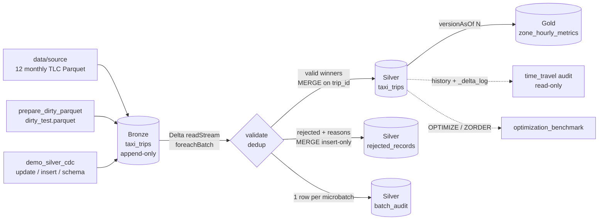

# Architecture

## Objective

Describe how data moves from the official NYC TLC Parquet files to an
analytics-ready Gold table, which Delta tables exist, and which module owns
each step.

## Logic

| Step | Module | Trigger |
|---|---|---|
| Dirty fixture | `src/bronze/prepare_dirty_parquet.py` | once, before Bronze |
| Bronze append | `src/bronze/bronze_ingestion.py` | per input file (batch) |
| Silver CDC | `src/silver/silver_pipeline.py` | Delta stream, `availableNow` or `processingTime` |
| Gold | `src/gold/gold_aggregation.py` | full recompute from one Silver version |
| Audit | `src/audit/time_travel.py` | on demand, read-only |
| Optimization | `optimization_benchmark.py` | once, adds two OPTIMIZE commits |
| Orchestration | `lakehouse_pipeline.py` | bronze -> silver -> gold (+ audit) |

Shared code lives in `src/common/`: `config.py` (all paths), `spark.py` (the
only SparkSession factory), `ids.py` (the `trip_id` formula) and
`delta_utils.py` (`latest_commit`, scoped `schema_auto_merge`).

## Input

- `data/source/yellow_tripdata_2025-MM.parquet`, 12 files, 48,722,602 trips.
- `data/landing/dirty_test.parquet`, 5,218 rows sampled from November.
- Synthetic CDC events appended to Bronze by `scripts/demo_silver_cdc.py`.

## Output

| Table | Path | Grain | Write pattern |
|---|---|---|---|
| Bronze | `data/bronze/taxi_trips` | one row per ingested source row | append, `mergeSchema` |
| Silver | `data/silver/taxi_trips` | one row per `trip_id` | MERGE (update newer+changed, insert new) |
| Rejected | `data/silver/rejected_records` | one row per (batch, raw hash) | MERGE insert-only |
| Batch audit | `data/silver/batch_audit` | one row per microbatch | MERGE on `batch_id` |
| Gold | `data/gold/zone_hourly_metrics` | one row per (PULocationID, pickup hour) | overwrite |
| Checkpoint | `data/checkpoints/silver_taxi` | streaming offsets/commits | managed by Spark |

None of the tables is partitioned; at ~10 GB a partition column would create
many small files without helping the main queries. Z-ORDER on
`PULocationID` provides the locality instead.

## Business rules

- Bronze never cleans or deduplicates; Silver never deletes Bronze data.
- `trip_id` = SHA-256 of vendor, zones, distance, pickup and dropoff
  (TLC has no trip identifier). It is the CDC key.
- Silver keeps one row per `trip_id`; a newer Bronze row replaces it only if
  its `business_hash` (amount columns) differs.
- Gold reads one pinned Silver version and records it in `silver_version`.

## Test cases

See the per-task documents; the full suite runs with `python -m pytest -q`
(40 tests, about one minute, temporary tables only).

## Expected result

A reproducible chain Bronze -> Silver -> Gold where every table is a Delta
table with history, Silver can be audited at any retained version, and Gold
can be rebuilt from any Silver version.

## Actual result

All four tables exist locally; Silver is at v48 (v46 data + two OPTIMIZE
commits) and Gold was built from Silver v46. See [REPORT.md](../REPORT.md).

## Code link

[`lakehouse_pipeline.py`](../lakehouse_pipeline.py), [`src/`](../src/)

## Notes

- Silver, rejected and batch_audit are three separate Delta transactions per
  microbatch, not one cross-table transaction. Spark replays a failed
  microbatch; all three writes are idempotent MERGEs.
- The checkpoint and the three Silver tables must be deleted or restored together.
